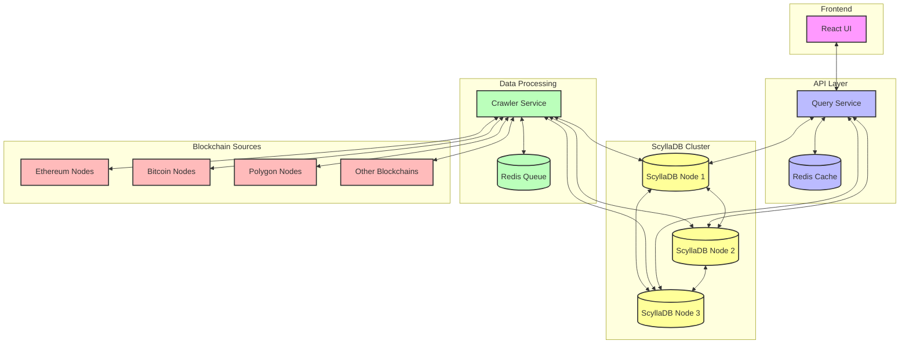

# HexSearch System Architecture

The project consists of three main components:

1. **Frontend**: React-based UI deployed on GitHub Pages
2. **Crawler Service**: Indexes blockchain data into ScyllaDB
3. **Query Service**: Handles search requests with Redis caching

## Architecture Diagram

## Component Details

### Frontend
- React-based single-page application
- Responsive design for mobile and desktop
- Real-time search with debouncing
- Result caching for improved performance

### Query Service
- Express.js REST API
- Redis caching layer for frequent queries
- Load balancing ready
- Rate limiting and request validation

### Crawler Service
- Blockchain data indexing
- Multiple blockchain support
- Configurable crawling strategies
- Queue-based processing

### Database Layer
- ScyllaDB for high-performance storage
- Optimized schema for hex searches
- Multi-node clustering support
- Automatic data partitioning

## Data Flow

1. User enters search query in UI
2. Query service checks Redis cache
3. If not cached, query service searches ScyllaDB
4. Results are cached and returned to UI
5. Crawler continuously indexes new blockchain data
6. New data is stored in ScyllaDB for future queries 
